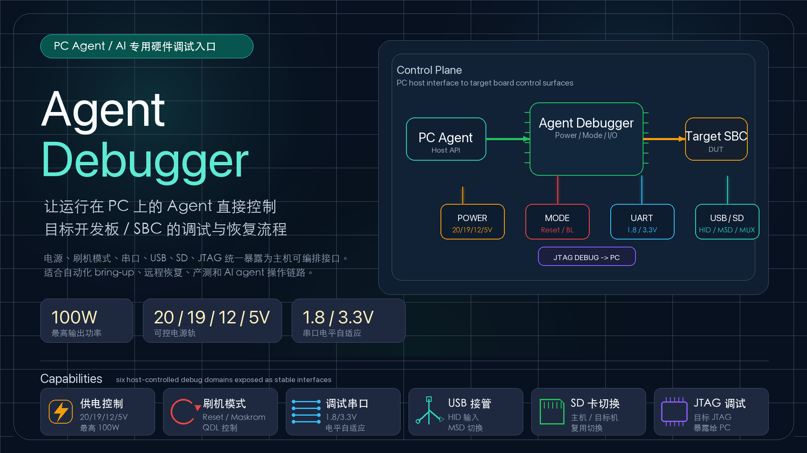

# radxa-linkr-debugger

[中文](README.zh-CN.md)

RP2350-series firmware for **Radxa Linkr Debugger**, a USB-controlled hardware
bridge that lets a PC-side Agent/AI operate target-board power, boot-mode,
TF/SD routing, current-monitor ADC channels, and a small safe GPIO surface.

The actively supported hardware is G3 with RP2350A. G2/RP2040 support is
retired: it receives no firmware builds, release artifacts, compatibility
fixes, or hardware validation. RP2354 hardware requires a dedicated board
definition and HIL validation before it can be declared supported.



## Features

| Area | Supported |
| --- | --- |
| USB control | Composite USB: NCM HTTP/WS + CDC ACM fallback |
| Host automation | Rust `linkr-host` for Web/gateway/Broker/MCP and raw UART RX archives, plus Rust CLI/TUI with JSON output |
| Web UI | Dashboard at http://172.29.203.1/ |
| Logic analyzer | PIO2+DMA, 100 kHz–125 MHz, WebSocket/raw-TCP Sigrok with a [common packed arena and current WIDE11 capture](docs/reference/logic-analyzer.md) |
| Power analyzer | Triggered capture with ring buffer, CSV/NDJSON export |
| Power outputs | `12v_out`, `5v_out`, `20v_out`, `vdd_5v` |
| ADC monitor | Current readings for `5v_out`, `12v_out`, and `20v_out` plus GP29/ADC3 voltage telemetry; see [docs/reference/adc-telemetry.md](docs/reference/adc-telemetry.md) |
| Switch routes | Firmware-advertised TF/SD, USB hub mux, TF write-protect (`writable`/`protected`), VIN (1.8V/3.3V) |
| GPIO | `GP7`–`GP20`; `GP29` remains cataloged but is input-only while owned by `adc3` (see [GP29 ownership](docs/reference/adc-telemetry.md#gp29-ownership)) |
| OTA update | MCUboot unsigned OTA |
| Watchdog | Autonomous recovery to BOOTSEL |
| Persistent configuration | [One explicit firmware-owned snapshot](docs/reference/persistent-configuration.md); safe values restore at boot, dangerous values require confirmation, and clear leaves live hardware unchanged |
| Captive portal | DHCP option 114/HTTP auto-open for Web UI |

WIDE11 uses a 144184 B hardware slice and a 30720 B WS telemetry ring within the 149048 B total backing allocation.

ADC3 contract, wire shapes, and GP29 ownership rules live in
[docs/reference/adc-telemetry.md](docs/reference/adc-telemetry.md); the dated
[2026-07-31 ADC3 telemetry HIL report](docs/testing/results/2026-07-31-adc3-telemetry-hil.md)
is the hardware-validation evidence for the GP29 direct-ownership subcase.

`5V_FIN` is intentionally treated as a separate input/source power input. It is
not exposed as a controllable output.

## Persistent Configuration

Persistent configuration is one explicit, firmware-owned snapshot on a
single v1 wire format; see the
[canonical contract](docs/reference/persistent-configuration.md). The snapshot header is
12 bytes; byte 4 version 1 is the only accepted version and byte 7 zero is
the only accepted restore padding. Save captures live values, persists the
v1 snapshot, and applies those values immediately, so a confirmed Save
persists and applies in one operation. Every structurally valid v1 snapshot
replays every saved entry, including dangerous values, on every normal boot
(v1 full restore); the firmware confirmation at Save time is the only danger
gate. A version byte other than 1 is never replayed, migrated, or
auto-cleared, and an explicit new Save is the only overwrite path. Replay
stops at the first hardware failure with applied, failed, and pending rows
reported; failed retry via repeated save is the only retry path. Clearing
the snapshot does not change live hardware.

Local validation is not real-hardware HIL. The 2026-08-05 real-hardware HIL
passed the v1 save-and-apply flow; see the
[dated v1-save HIL report](docs/testing/results/2026-08-05-persistent-config-v1-save-hil.md).
The historical 2026-07-30 real-hardware HIL passed all six runner flows;
see the [historical six-flow report](docs/testing/results/2026-07-30-persistent-config-hil.md).
Future local tests remain distinct from board HIL.

### Frozen Contract Summary

| Contract ID | Frozen literal |
| --- | --- |
| `storage` | `storage_partition+Settings+NVS` |
| `snapshot` | `linkr/config/snapshot;v1;one` |
| `explicit-save` | `ordinary-setters-volatile;explicit-save-only` |
| `boot-restore` | `defaults-first;v1-full-restore` |
| `header` | `12B-header;byte4-version=1;byte7-zero;max-104B` |
| `firmware-confirmation` | `firmware-owned-confirmation;save-time-only` |
| `save` | `persists-and-applies;failed-retry-via-resave` |
| `clear` | `settings_delete;hardware-unchanged` |
| `busy` | `busy:capture\|ota` |
| `recovery` | `BOOTSEL:radxa-linkr-debugger-rp2350.uf2;OTA:radxa-linkr-debugger-rp2350-ota.bin;zephyr.uf2-invalid` |
| `security` | `no-profiles;no-encryption;no-authentication-or-authorization;no-config-rollback` |
| `hil-boundary` | `local-distinct;real-HIL-2026-08-05-v1-save-pass` |

## Quick Start

1. [Install the CLI](docs/user/install.md)
2. Connect the board via USB
3. Run `radxa-linkr-debuggerctl doctor`
4. Open http://172.29.203.1/ for the Web UI

```sh
radxa-linkr-debuggerctl --version
radxa-linkr-debuggerctl doctor
radxa-linkr-debuggerctl status
```

For the host-served Web UI, shared serial sessions, and resident MCP, use the
unified installer:

```sh
./scripts/install-host.sh
```

The tray icon then supervises Web/Broker/MCP. Web is available at
<http://127.0.0.1:8787/> and MCP at
<http://127.0.0.1:8787/mcp>. For development, build and run the single Rust
Host manually:

```sh
npm --prefix web ci
npm --prefix web run build
cargo run --manifest-path host-tools/Cargo.toml -- serve
```

See
[Host Tools](host-tools/README.md) and the [MCP server](docs/reference/mcp-server.md).

If the released host CLI is not downloaded or installed yet, see
[Install the CLI](docs/user/install.md) for the stable release channel and the
separate rolling nightly channel. Agents can use the bounded local
[MCP server](docs/reference/mcp-server.md) for shared UART and common board operations;
curl remains the cross-platform fallback. For automation through the CLI, prefer
`--json`; parse `schema`, `ok`, `command`, and `error.code` instead of
human-readable text.

## Documentation

The canonical tree lives under `docs/`. Start at the
[Documentation Index](docs/README.md) for the full layout, including
reference contracts, HIL procedures, hardware references, and shared
artwork.

- [User Guide](docs/user/README.md) — CLI, TUI, Web UI, OTA, OpenOCD, Logic Analyzer, Power Analyzer
- [Developer Guide](docs/developer/README.md) — Build, flash, contribute, hardware mapping
- [Testing](docs/testing/hil-functional-test-spec.md) — HIL spec and dated board-level evidence
- [Persistent Configuration](docs/reference/persistent-configuration.md) — Firmware-owned snapshot, restore, and confirmation behavior

## For AI Agents

AI agents should read [skills/radxa-linkr-debugger/SKILL.md](skills/radxa-linkr-debugger/SKILL.md)
before operating hardware through this project. The skill is the canonical,
MCP-first Agent-facing procedure when the local server is available, with curl
and the primary host CLI retained as explicit fallbacks.

Before making repository changes, AI agents should also read
[AGENTS.md](AGENTS.md). Repository-local rules:

- Any code change must update the related skill and documentation in the same change.
- Firmware or host CLI logic changes must update the related guidance and run the relevant tests.
- Firmware changes must verify and preserve the USB CDC ACM serial BOOTSEL fallback path before finishing.
- Skill changes must include a subagent validation/test run.
- When adding new functionality, add corresponding functional tests whenever practical.
- Firmware and hardware-interactive host changes require HIL functional testing before conclusion; see `AGENTS.md` and `docs/testing/hil-functional-test-spec.md`.
- Prefer describing board hardware in Device Tree whenever Zephyr bindings and the board model can express it cleanly.
- Keep software implementation standard, consistent, and elegant; avoid ad hoc patterns that make maintenance, automation, or documentation harder to follow.
- Keep MCU-side output as close as practical to raw interface values; prefer host-side interpretation, calibration, and presentation when that preserves the raw firmware contract.

Recommended agent flow:

```sh
# Preferred local Agent integration; see docs/reference/mcp-server.md for client config.
cargo run --manifest-path host-tools/Cargo.toml -- mcp

# CLI fallback and diagnostics.
radxa-linkr-debuggerctl --version
radxa-linkr-debuggerctl --json doctor
radxa-linkr-debuggerctl --json status
```

If the released host CLI is not downloaded or installed yet, use the release
installation path below. When MCP is unavailable, follow the skill's curl
fallback workflow. For automation through the CLI, prefer `--json`;
parse `schema`, `ok`, `command`, and `error.code` instead of human-readable
text.

## Repository Layout

```text
apps/radxa_linkr_debugger/        Zephyr application
apps/radxa_linkr_debugger/src/    Firmware source and shared board model
apps/radxa_linkr_debugger/tests/  Unit tests
cmd-ng/                          Primary Rust host CLI/TUI
web/                             Web UI and device bridge
docs/                            Documentation tree (user, developer, reference, testing, hardware, and assets)
skills/radxa-linkr-debugger/     Agent-facing skill and operating guide
west.yml                         Zephyr workspace manifest
```
