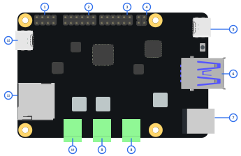

[English](board-overview.md)

# 调试板概览

Radxa Linkr Debugger 是一块 USB 控制的硬件桥接板，用于自动化 bring-up、恢复和调试。一根 USB 线连到 PC，就能控制目标板供电、启动模式、SD 路由、电流监测和 GPIO——全部可通过 CLI、Web UI 或 AI Agent 脚本化操作。



*该俯视图用于快速定位主要接口；电气定义和针脚编号请以下方表格及原理图为准。*

### 接口标注

图中的蓝色数字是文档标注编号，不是 PCB 丝印编号；`Jxx` 才是原理图位号。

| 编号 | 位号 | 接口 | 说明 |
|---:|---|---|---|
| 1 | J18 | SPI 排针 | CH347F SPI 信号：SCS0、MISO、SCK、MOSI、3.3 V 和 GND |
| 2 | J11 | UART / I2C 排针 | CH347F 双 UART 和可复用 I2C 信号排针 |
| 3 | J8 | JTAG / SWD 排针 | 目标板调试信号，VIO 可在 1.8 V / 3.3 V 间切换 |
| 4 | J13 | 恢复控制 GPIO | `CON_MAS`、`CON_REST`、`CON_USER`；1 脚为 NC |
| 5 | J3 | 目标 USB-C | 通过板载 USB hub 路由的 USB 3 目标板 / OTG 接口 |
| 6 | J12 | USB 设备切换接口 | 双层 USB 3：上层连接目标板，下层插入待切换 USB 设备 |
| 7 | J1 | DC 输入 | DC5525 圆孔接口，主 20 V 输入 |
| 8 | J6 | 20 V 输出 | 可控 `20v_out` 接线端子 |
| 9 | J5 | 12 V 输出 | 可控 `12v_out` 接线端子 |
| 10 | J7 | 5 V 输出 | 可控 `5v_out` 接线端子 |
| 11 | J2 | TF / microSD 卡槽 | 可在目标板与主机 USB 读卡器路径间切换 |
| 12 | J15 | PC + Debug USB-C | USB NCM、CDC ACM 和 CH347F 的主机连接口 |

该简化示意图未单独绘出 J16 安全 GPIO 排针；连接 GPIO 或逻辑分析仪探针时，
请以下方 J16 针脚表为准。

以下连接器编号以当前 G3 原理图
（[`docs/hardware/radxa-linkr-debugger-schematic-x1.1.pdf`](../hardware/radxa-linkr-debugger-schematic-x1.1.pdf)）
为准。连接排线或探针前，请先确认板上丝印的 1 脚标记。

## 接口和端口

### Host USB

单根 USB-C 连接到 PC。板子枚举为复合设备：
- **USB NCM** — 网络接口，控制面地址 `http://172.29.203.1`
- **USB CDC ACM** — 串口 fallback，用于 Zephyr shell 和 BOOTSEL 恢复

Linux 和 macOS 无需安装驱动。Windows 需要标准 CDC ACM 驱动。

### 目标板调试口（CH347F）

板载 CH347F 提供两路 UART 和一个 JTAG/SWD 口，直连目标板调试连接器。RP2350 固件不在 JTAG/SWD 数据链路中——CH347F 作为独立调试探针工作。

| 通道 | 设备后缀 | 用途 |
|------|---------|------|
| UART0 | `D1` | 主串口（U-Boot、内核、登录） |
| UART1 | `D3` | 第二串口通道 |
| JTAG/SWD | — | 通过 OpenOCD 调试目标板 |

VIO 电压可选 3.3V（默认）或 1.8V（`switch vin`）。两路 UART 共享同一 VIO 电平。

### 电源输出

三条可控电源轨，为目标板供电：

| 输出 | 电压 | 典型用途 |
|------|------|---------|
| `5v_out` | 5V | SBC、开发板 |
| `12v_out` | 12V | 较高功耗目标 |
| `20v_out` | 20V | USB-PD 级目标 |

每条电源轨都有电流传感监测（INA139），通过 `adc read` 读取。

`5V_FIN` 是板子的供电输入，不是可控输出。

### TF/SD 卡槽

Micro-SD 卡槽，带硬件 mux 在两条路径间切换：

| 路由 | 说明 |
|------|------|
| `target`（默认） | SD 卡出现在目标板上 |
| `usb-reader` | SD 卡作为 USB 大容量存储出现在主机上 |

切换命令：`radxa-linkr-debuggerctl switch route sd usb-reader`。

### USB 设备切换（J12）

J12 是双层 USB 3 接口，两层用途不同：

- **上层接口** — 连接目标板。
- **下层接口** — 插入需要共享的 USB 设备。

USB mux 可以把下层插入的设备切换到 J15 所连接的主机，或切换到上层接口所连接的
目标板：

```sh
radxa-linkr-debuggerctl switch route usb target --confirm
radxa-linkr-debuggerctl switch route usb pc --confirm
```

切换前应先卸载存储设备并停止正在进行的 USB 传输。可使用
`radxa-linkr-debuggerctl switch get usb` 确认当前路径。

### GPIO 排针

**J13**（2×2）— 三个专用 GPIO 和一个未连接引脚：

| 引脚 | GPIO | 标签 | 典型用途 |
|------|------|------|---------|
| 1 | — | NC | 未连接，不可作为 GPIO 使用 |
| 2 | GP9 | CON_USER | 用户自定义 |
| 3 | GP7 | CON_MAS | MASKROM 入口信号 |
| 4 | GP8 | CON_REST | 复位控制 |

**J16**（6×2）— 通用 GPIO 和模拟输入：

| 引脚 | GPIO | 说明 |
|------|------|------|
| 1 | GP10 | 数字 I/O，可用于逻辑分析仪 |
| 2 | GP16 | 数字 I/O，可用于逻辑分析仪 |
| 3 | GP11 | 数字 I/O，可用于逻辑分析仪 |
| 4 | GP17 | 数字 I/O，可用于逻辑分析仪 |
| 5 | GP12 | 数字 I/O，可用于逻辑分析仪 |
| 6 | GP18 | 数字 I/O，可用于逻辑分析仪 |
| 7 | GP13 | 数字 I/O，可用于逻辑分析仪 |
| 8 | GP19 | 数字 I/O，可用于逻辑分析仪 |
| 9 | GP14 | 数字 I/O，可用于逻辑分析仪 |
| 10 | GP20 | 数字 I/O，可用于逻辑分析仪 |
| 11 | GP15 | 数字 I/O，可用于逻辑分析仪 |
| 12 | GP29 | ADC3 模拟输入 |

J13 的三个已连接 GPIO 和 J16 的十二个信号引脚都在安全 GPIO 允许列表中。
逻辑分析仪可以在这些 GPIO 上以最高 125 MHz 采样。

### 状态 LED

GPIO25 上的蓝色 LED。作为 watchdog 心跳指示——固件健康时约 1 Hz 闪烁。watchdog 触发后停止闪烁。

## 快速参考

```
radxa-linkr-debuggerctl power set 5v_out on       # 给目标板上电
radxa-linkr-debuggerctl switch route sd usb-reader  # 从主机读取 SD
radxa-linkr-debuggerctl gpio set GP13 1             # 驱动 GPIO
radxa-linkr-debuggerctl adc read                    # 查看电流
radxa-linkr-debuggerctl doctor                      # 完整连接检查
```
